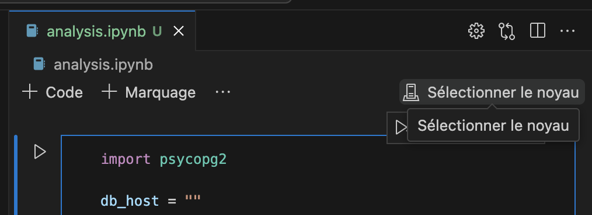
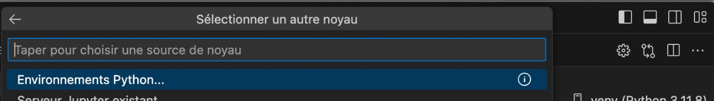
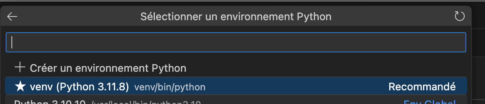

# Pur Project Data Engineer Python Exercise

Welcome to the [Pur Project](https://www.pur.co/fr/) Data Engineer Python Exercise repository! This exercise is designed to test your coding, analytical, and presentation skills as a candidate applying for a data engineer position at Pur Project.

## Objective
The objective of this exercise is to assess your ability to manipulate data using Python, PostgreSQL, perform data analysis and visualization and present your findings effectively.

## Getting started
To get started with the exercise, follow these steps:
1. Clone this repository to your local machine.
2. Create a virtual env. Follow the steps in the section ["Creating and Accessing to your virtual environment"](#creating-and-accessing-your-virtual-environment) to guide you.
4. Complete the exercise according to the instructions.

## Exercise instructions

1. You will be provided access to a pre-existing PostgreSQL database, already populated with initial data about trees, including species, sizes, locations, and associated farmers' details. Load the CSV file [tree_data.csv](data/tree_data.csv) into the database, in this table named `raw_data`.
2. Answer to the questions in the "Data Quality" section of the [Jupyter Notebook](analysis.ipynb)
3. Expose the data in a normalized operational data model. We expect you to provide the code which perform this modelization (SQL or Python).
4. By using Python, provide a modelization of a farmer and by running your code, you would get a farmer's instance (the data can be mocked or from the database)
5. Answer to the questions in the "Data Analysis" section of the [Jupyter Notebook](analysis.ipynb)

## Submission guidelines
Once you have completed the exercise, follow these guidelines for submission:
1. Ensure that your Python code follows coding best practices, however, it is not intendend to be "prod-ready".
2. If your code requires any additional packages, include a `requirements.txt` file listing them.
3. Write your Python code following the structure of repository of your choice: the expected output should be a [private github repository shared to Pur data eng team members](https://docs.github.com/fr/account-and-profile/setting-up-and-managing-your-personal-account-on-github/managing-access-to-your-personal-repositories/inviting-collaborators-to-a-personal-repository)
4. Once finished, we will swiftly review your submission and set up a presentation meeting together to let you present your solution and explain your approach, methodology and challenges faced during this exercise.

## Creating and accessing your virtual environment 
1. Make sure you have a python version higher or equal than 3.8. We won't accept code from a lower version.
2. Using a terminal, type the command: `python -m venv venv`
3. If using VS Code, find below some indications on how to activate your virtual env in the Jupyter Notebook (but feel free to use the IDE of your chocie to interact with Jupyter Notebook).

 

 

 

## Contact
If you have any questions or need clarification on the exercise instructions, please contact [data-fr@pur.co](mailto:data-fr@pur.co)

Happy coding, and best of luck with the exercise!
